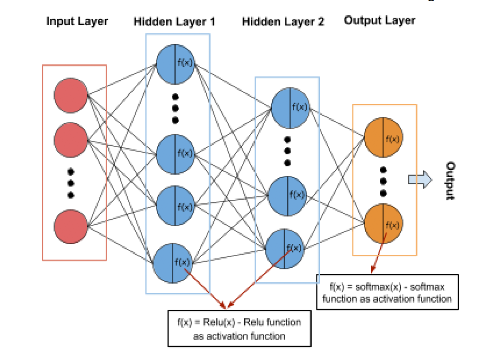
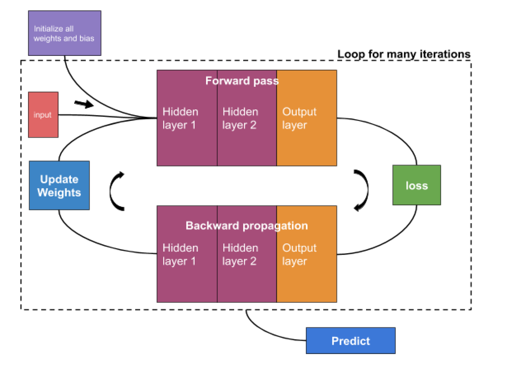

# Neural-Network-from-Scratch
Build a Neural Network from scratch in Python (Adam optimizer for SGD, and ReLU activation function)

#### Problem Description:
1. We use 3 blackbox datsets, each accompanied with a training data file, testing data, and predictions to verify model output
2. Construct a Neural Network Classifier from the given training data (w/o ML library calls)
3.  Use the learned classifier to classify the unlabeled test data (Multi-Class labels)

#### Features of Program:
1. xavier() - xavier initialization as oposed to assigning andom weights
2. relu() - it is used to compute output relu activation function
3. inplace_relu_derivative() - it is used to compute derivative of relu function
4. softmax() - it is used to compute softmax function for output layer
5. log_loss() - it is used to compute logistic loss (cross entropy)
6. SGDOptimizer Class - implements stochastic gradient descent optimizer algorithm
    with momentum.
7. AdamOptimizer Class - implements adam optimizer algorithm.
8. gen_batches() - split dataset to generate small batches.
9. label_binarize() - binarize label for multiclass

#### Program Structure:
1. Split dataset to batches 
2. Initialize weights and bias - Xavier initialization
3. Select one batch of data and calculate forward pass - follow the basic structure of
neural network to compute output for each layer, and cache output of each
layer for convenient of backward propagation.
4. Compute loss function - cross-entropy (logistic loss)
5. Backward propagation - use backprop to update hidden weights
6. Updates weights using optimization algorithms - there are many ways to update
weighs, utils.py has 2 (SGD and Adam)
7. Repeat 2,3,4,5,6 for all batches - after finishing this process for all batches (it just
iterates all data points of dataset), it is called ‘one epoch’.
8. Repeat 2,3,4,5,6,7 number of epochs times - we train many epochs to
get a good result

#### Hyperparameters:
1. Number of Hidden layers
2. Number of Neurons in each hidden laye
3. Learning Rate, or alpha
4. Batch Size, which is no. of samples processed before model updated
5. Number of epochs

#### See plots for log_loss and accuracy plots

#### References:
1. https://github.com/mnielsen/neural-networks-and-deep-learning
2. http://neuralnetworksanddeeplearning.com/chap1.html
3. https://www.youtube.com/watch?v=IHZwWFHWa-w
4. https://stats.stackexchange.com/questions/181/how-to-choose-the-numberof-hidden-layers-and-nodes-in-a-feedforward-neural-netw
5. https://towardsdatascience.com/weight-initialization-techniques-in-neuralnetworks-26c649eb3b78
6. https://www.youtube.com/watch?v=x_Eamf8MHwU
7. https://stats.stackexchange.com/questions/181/how-to-choose-the-numberof-hidden-layers-and-nodes-in-a-feedforward-neural-netw
8. https://medium.com/binaryandmore/beginners-guide-to-deriving-andimplementing-backpropagation-e3c1a5a1e536
9. https://ml-cheatsheet.readthedocs.io/en/latest/backpropagation.html
10. https://towardsdatascience.com/weight-initialization-techniques-in-neuralnetworks-26c649eb3b78
11. https://medium.com/datadriveninvestor/overview-of-different-optimizersfor-neural-networks-e0ed119440c3
12. https://www.python-course.eu/neural_networks_with_python_numpy.php
13. https://medium.com/better-programming/how-to-build-2-layer-neuralnetwork-from-scratch-in-python-4dd44a13ebba
14. https://mattmazur.com/2015/03/17/a-step-by-step-backpropagationexample/
15. https://medium.com/datadriveninvestor/overview-of-different-optimizersfor-neural-networks-e0ed119440c3
